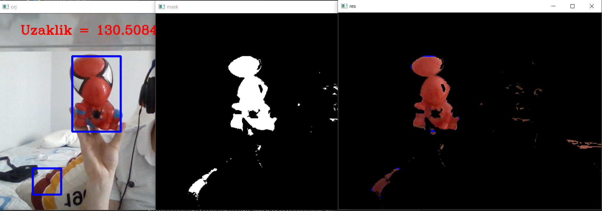

## Step By Step DetectingColor-FindingDistance Installation

**Attention❗️** 
* This application was made for the 2021 UAV competition, it is strictly forbidden to use it in any competition.
* The purpose of this application is to detect red colored objects and determine the appropriate distance to it.

🔺 **Step 1:** Download nececary npm 
>npm install opencv [More informations about cv2][cv2]

🔺 **Step 2:** İnstall nececary pip
>pip install numpy [More informations about numpy][numpy]
 
🔺 **Step 3:** OPENCV-DetectingColor-FindingDistance published by Mustafa is cloned from the GitHub repository.
>git clone https://github.com/mustafakendiguzel/OPENCV-DetectingColor-FindingDistance.git

🔺 **Step 4:** 
Find the object who has red color,then measure length and width

🔺 **Step 5:** 
in width_distance file fill your measured values with known_width and known_distance

🔺 **Step 6:** 
-Upload a photo named 'resim.jpg'(in this photo there could be some other things or you can be seen thats not problem)

🔺 WARNİNG!
-Distance measurement is not 100% accurate. Accuracy is higher for objects closer to the length and width of the object you are measuring.

A view from the project: 

[cv2]: https://www.npmjs.com/package/opencv2
[numpy]: https://numpy.org/install/
