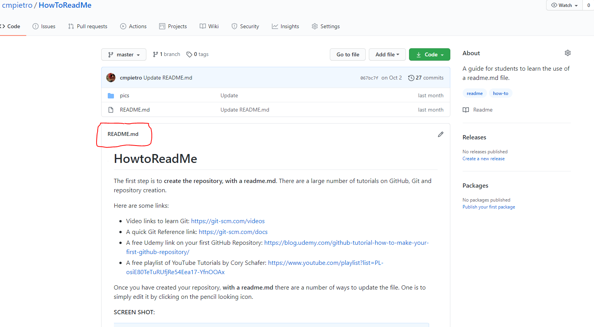

## Step By Step Mask RCNN Installation

**Attention❗️** 
* This application was made for the 2021 UAV competition, it is strictly forbidden to use it in any competition.

🔺 **Step 1:** Download nececary npm 
>npm install opencv[More informations about cv2][cv2]

🔺 **Step 2:** İnstall nececary pip
>pip install numpy[More informations about numpy][numpy]
 
🔺 **Step 3:** OPENCV-DetectingColor-FindingDistance published by Mustafa is cloned from the GitHub repository.
>git clone https://github.com/mustafakendiguzel/OPENCV-DetectingColor-FindingDistance.git

🔺 **Step 4:** 

A view from the project: 

cv2: https://www.npmjs.com/package/opencv2
numpy: https://numpy.org/install/
